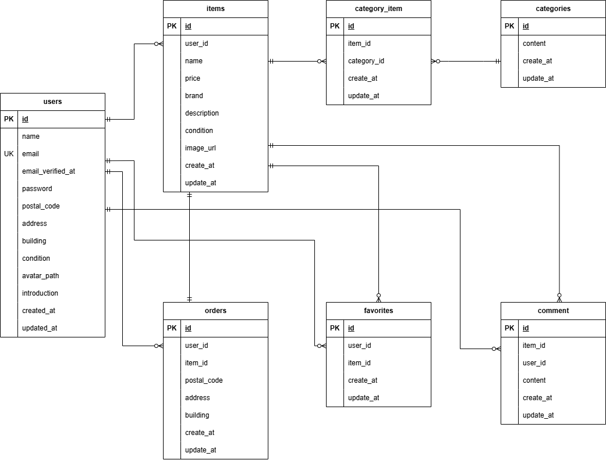

# coachtechフリマ

独自のCtoCフリマアプリ開発プロジェクトです。
10〜30代の社会人をターゲットに、シンプルで使いやすい出品・購入体験を提供することを目的としています。

## 推奨環境
- **ブラウザ**: Chrome / Firefox / Safari (最新版)
- **デバイス**: PC

## 環境構築

### リポジトリのクローンと起動
#### Dockerビルド  
1. `git clone git@github.com:so-akemi/coachtech-frima.git`  
2. `cd coachtech-frima`  
3. DockerDesktopアプリを立ち上げる  
4. `docker-compose up -d --build`

### Laravel環境構築
#### コンテナ内に入り、依存関係のインストールと初期設定を行います。
- コンテナ内に入る  
`docker compose exec php bash`
- 依存関係のインストール  
`composer install`
- 環境設定ファイルの作成  
`cp .env.example .env`
- アプリケーションキーの生成  
`php artisan key:generate`
- ストレージリンクの作成（商品画像表示用）  
`php artisan storage:link`

### データベース接続設定と構築
####  .envファイルの設定(srcディレクトリ直下)  

- データベース接続設定(下記の通り修正)  
    ```
    DB_CONNECTION=mysql  
    DB_HOST=mysql  
    DB_PORT=3306  
    DB_DATABASE=laravel_db  
    DB_USERNAME=laravel_user  
    DB_PASSWORD=laravel_pass
    ```

- メール認証機能の設定(MAIL_FROM_ADDRESSを修正)
    ```
    MAIL_MAILER=smtp
    MAIL_HOST=mailhog
    MAIL_PORT=1025
    MAIL_USERNAME=null
    MAIL_PASSWORD=null
    MAIL_ENCRYPTION=null
    MAIL_FROM_ADDRESS=admin@example.com
    MAIL_FROM_NAME="${APP_NAME}"
    ```

- 決済機能（stripe）の設定  
     本アプリの動作確認には、Stripeのテスト用APIキーが必要です。
     [Stripeダッシュボード※要ログイン](https://dashboard.stripe.com/test/apikeys)から取得したキーを、以下の項目に設定してください。
    ```  
     STRIPE_PUBLIC_KEY=pk_test_...（ご自身の公開鍵を貼り付け）  
     STRIPE_SECRET_KEY=sk_test_...（ご自身の秘密鍵を貼り付け）
    ```


※ Note: 権限エラーで保存できない場合は、下記コマンドをプロジェクトルート（srcディレクトリ等）で実行してください。 
``` 
sudo chown -R $USER:$USER . 
chmod 664 .env
``` 
(コマンド実行後、ファイルの変更を保存してください)

#### 設定反映後、PHPコンテナ内にて下記コマンドを実行してください。
```
php artisan config:clear
php artisan cache:clear
```

#### マイグレーションとシーディングを実行  
`php artisan migrate --seed`  

### ディレクトリ権限の設定
#### ファイルの書き込みエラーを防ぐため、コンテナ内の src ディレクトリにて以下の権限付与を実行してください。
`chmod -R 777 storage bootstrap/cache`


※エラーが発生した場合は、下記コマンドでコンテナ再起動後、再度php artisan config:clear～php artisan migrate:fresh --seedを実行してください。
```
docker-compose down
docker-compose up -d
```

## 使用技術（実行環境）

- PHP 8.2.11
- Laravel 8.x
- MySQL 8.0.26
- Nginx 1.21.1
- Docker / Docker Compose
- Stripe API

## ER図


URL一覧
- トップ画面: http://localhost/  
- ログイン画面: http://localhost/login
- 会員登録画面: http://localhost/register
- マイページ: http://localhost/mypage
- phpMyAdmin: http://localhost:8080/

## 機能一覧
- 認証機能: ログイン・ログアウト・会員登録
- 商品一覧: 商品の全件表示・商品名によるキーワード検索
- 商品詳細: 商品情報の閲覧・コメント投稿
- お気に入り機能: 商品詳細画面での登録/解除
- 出品機能: 商品画像のアップロード・価格/カテゴリ設定
- 購入機能: 商品の購入処理
- プロフィール: プロフィール画像・住所・氏名の編集
- マイページ: 出品した商品・購入した商品・お気に入りした商品のリスト表示

## テスト用ログイン情報
php artisan db:seed 実行後、以下のユーザーで即座に動作確認が可能です。

- メールアドレス：test123@example.com
- パスワード：coachtech123test
- 郵便番号：123-4567
- 住所：東京都渋谷区テスト123